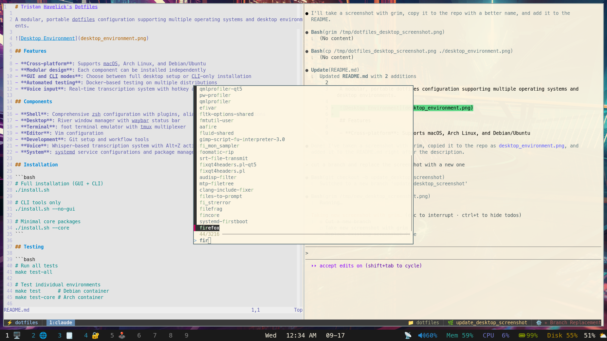

# Tristan Havelick's Dotfiles

A modular, portable dotfiles configuration supporting multiple operating systems and desktop environments.



## Features

- **Cross-platform**: Supports macOS, Arch Linux, and Debian/Ubuntu
- **Modular design**: Each component can be installed independently
- **GUI and CLI modes**: Choose between full desktop setup or CLI-only installation
- **Automated testing**: Docker-based testing on multiple distributions
- **Voice input**: Real-time transcription system with hotkey activation

## Components

- **Shell**: Comprehensive zsh configuration with plugins, aliases, and custom functions
- **Desktop**: River window manager with waybar status bar
- **Terminal**: foot terminal emulator with tmux multiplexer
- **Editor**: Vim configuration
- **Development**: Git setup and workflow tools
- **Voice**: Whisper-based transcription system with Alt+Z activation
- **System**: systemd service configurations and package management

## Installation

```bash
# Full installation (GUI + CLI)
./install.sh

# CLI tools only
./install.sh --no-gui

# Minimal core packages
./install.sh --core
```

## Testing

```bash
# Run all tests
make test-all

# Test individual environments
make test      # Debian container
make test-core # Arch container

# Interactive testing
make run       # Debian container
make run-core  # Arch container
```

## Development

```bash
# Lint all code
make lint

# Format Python code
make format

# Check for secrets
make check-secret TARGET=path/to/check
```

## Voice Input

The whisper system provides real-time transcription:
- Press Alt+Z to start/stop transcription (River hotkey only)
- Works in any environment, but hotkey requires River setup
- Streaming recognition with voice activity detection
- Configurable through systemd services

## River Window Manager

Key bindings and features:
- Press Alt+H to bring up the help overlay with all keybindings
- Alt+Z voice input hotkey (when whisper is configured)

## Structure

```
├── zsh/           # Shell configuration
├── river/         # Window manager
├── waybar/        # Status bar
├── foot/          # Terminal
├── tmux/          # Multiplexer
├── vim/           # Editor
├── whisper/       # Voice input
├── arch/          # Arch packages
├── debian/        # Debian packages
└── mac/           # macOS packages
```

## Requirements

- **macOS**: Homebrew
- **Arch Linux**: pacman, yay (auto-installed)
- **Debian/Ubuntu**: apt